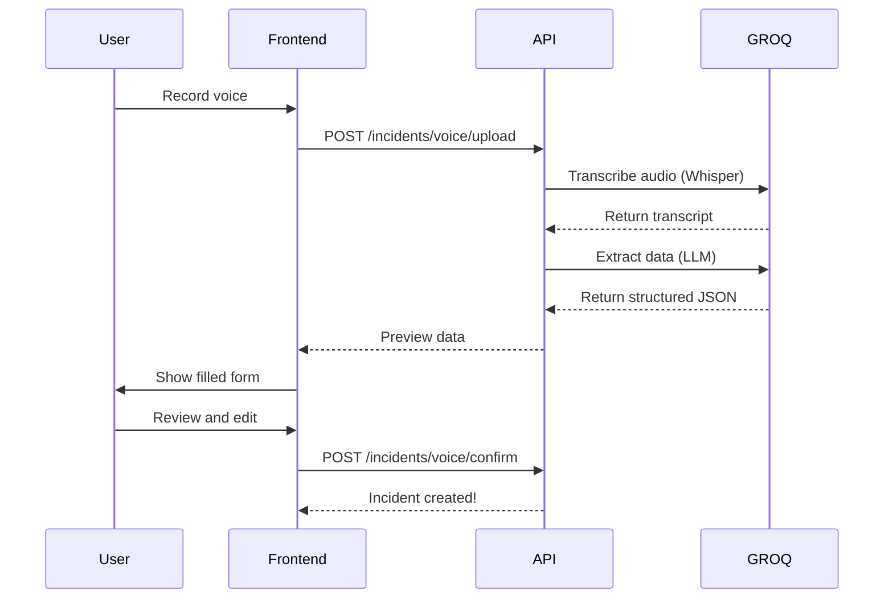

# Voice Recording Incident Feature 🎙️

## Overview
The Voice Recording Incident feature allows farmers and farm workers to report incidents by simply recording their voice. The system automatically transcribes the audio and extracts structured incident data using AI (GROQ API).

## Features

### 1. **Manual Incident Creation**
Traditional form-based incident reporting with all fields manually entered.

### 2. **Voice-Based Incident Creation**
- Record incident details via voice
- Automatic transcription (supports multiple languages)
- AI extraction of structured data
- Preview and edit before saving

## Setup Instructions

### 1. Get GROQ API Key

1. Visit [https://console.groq.com](https://console.groq.com)
2. Sign up for a free account
3. Navigate to API Keys section
4. Generate a new API key
5. Copy the API key

### 2. Configure Environment

Add your GROQ API key to the `.env` file:

```env
GROQ_API_KEY=your_actual_groq_api_key_here
```

Replace `your_actual_groq_api_key_here` with the actual key from GROQ.

### 3. Restart Server

After adding the API key, restart the FastAPI server:

```bash
cd backend
uvicorn app.main:app --reload
```

## API Endpoints

### 1. Create Incident Manually

**POST** `/incidents/manual`

**Request Body:**
```json
{
  "title": "Pest Attack on Field 1",
  "description": "Large number of aphids found on wheat crop",
  "incident_type": "PEST_ATTACK",
  "severity": "HIGH",
  "field_id": "F_001",
  "location_description": "North-west corner of field",
  "affected_area_acre": 2.5,
  "estimated_loss": 15000,
  "crop_affected": "Wheat",
  "incident_date": "2025-10-12T10:30:00",
  "reported_by_user_id": "uuid-of-reporter",
  "action_taken": "Applied neem oil spray"
}
```

### 2. Upload Voice Recording

**POST** `/incidents/voice/upload`

**Form Data:**
- `file`: Audio file (WAV, MP3, M4A, OGG, WEBM)
- `reported_by_user_id`: UUID of the user reporting

**Response:**
```json
{
  "transcript": "There is a severe pest attack in field one...",
  "extracted_data": {
    "title": "Pest Attack in Field One",
    "description": "Severe pest attack observed...",
    "incident_type": "PEST_ATTACK",
    "severity": "HIGH",
    "field_id": "F_001",
    "affected_area_acre": 2.0,
    "estimated_loss": 10000,
    "crop_affected": "Wheat",
    ...
  },
  "audio_file_path": "uploads/audio/uuid.wav"
}
```

### 3. Confirm Voice Incident

**POST** `/incidents/voice/confirm`

After reviewing the extracted data, confirm and save:

```json
{
  "audio_file_path": "uploads/audio/uuid.wav",
  "transcript": "There is a severe pest attack...",
  "extracted_data": {
    "title": "Pest Attack in Field One",
    "description": "Severe pest attack observed...",
    "incident_type": "PEST_ATTACK",
    "severity": "HIGH",
    ...
  },
  "reported_by_user_id": "uuid-of-reporter"
}
```

**Note:** User can modify any fields in `extracted_data` before confirming.

### 4. Get All Incidents

**GET** `/incidents/`

**Query Parameters:**
- `skip`: Pagination offset (default: 0)
- `limit`: Number of results (default: 100)
- `status`: Filter by status (REPORTED, IN_PROGRESS, RESOLVED, CLOSED)
- `field_id`: Filter by field
- `severity`: Filter by severity

### 5. Get Single Incident

**GET** `/incidents/{incident_id}`

### 6. Update Incident

**PUT** `/incidents/{incident_id}`

**Request Body:**
```json
{
  "status": "IN_PROGRESS",
  "assigned_to_user_id": "uuid-of-assignee",
  "action_taken": "Applied pesticide spray",
  "resolution_notes": "Monitoring progress"
}
```

### 7. Delete Incident

**DELETE** `/incidents/{incident_id}`

## Incident Types

- `PEST_ATTACK` - Pest infestation
- `DISEASE` - Crop disease
- `WEATHER_DAMAGE` - Weather-related damage
- `EQUIPMENT_FAILURE` - Farm equipment breakdown
- `IRRIGATION_ISSUE` - Irrigation problems
- `THEFT` - Theft or vandalism
- `ANIMAL_DAMAGE` - Animal damage to crops
- `SOIL_ISSUE` - Soil-related problems
- `OTHER` - Other incidents

## Severity Levels

- `LOW` - Minor issue, no immediate action required
- `MEDIUM` - Moderate issue, action needed soon
- `HIGH` - Serious issue, immediate attention required
- `CRITICAL` - Emergency situation

## Status Workflow

1. **REPORTED** - Incident has been reported
2. **IN_PROGRESS** - Someone is working on it
3. **RESOLVED** - Issue has been resolved
4. **CLOSED** - Incident is closed and archived

## Voice Recording Workflow



## Supported Audio Formats

- WAV (Recommended)
- MP3
- M4A
- OGG
- WEBM

## Best Practices

### For Voice Recording:

1. **Speak clearly and at moderate pace**
2. **Include key details:**
   - What happened
   - Where it happened (field/location)
   - When it happened
   - How much area affected
   - Estimated loss
   - Action taken

3. **Example voice script:**
   > "This is a high severity pest attack incident in Field F_001. I found a large number of aphids on the wheat crop in the northwest corner. Approximately 2 and a half acres are affected. I estimate the loss around 15,000 rupees. I have already applied neem oil spray as immediate action."

### For Manual Entry:

- Fill in as many fields as possible
- Be specific in descriptions
- Include GPS coordinates if available
- Attach photos if possible (future feature)

## Troubleshooting

### GROQ API Errors

**Error:** `GROQ_API_KEY not found`
- **Solution:** Add GROQ_API_KEY to .env file and restart server

**Error:** `Error transcribing audio`
- **Solution:** Check audio file format, ensure it's not corrupted
- Try converting to WAV format

**Error:** `Error extracting incident data`
- **Solution:** Check if transcript is clear
- Try speaking more clearly or re-recording

### Audio Upload Errors

**Error:** `Invalid file type`
- **Solution:** Use supported formats: WAV, MP3, M4A, OGG, WEBM

**Error:** `File too large`
- **Solution:** Keep recordings under 25MB
- Compress audio if needed

## Testing

### Test Manual Incident Creation

```bash
curl -X POST "http://localhost:8000/incidents/manual" \
  -H "Authorization: Bearer YOUR_TOKEN" \
  -H "Content-Type: application/json" \
  -d '{
    "title": "Test Incident",
    "description": "This is a test incident",
    "incident_type": "OTHER",
    "severity": "LOW",
    "reported_by_user_id": "user-uuid-here"
  }'
```

### Test Voice Upload

```bash
curl -X POST "http://localhost:8000/incidents/voice/upload" \
  -H "Authorization: Bearer YOUR_TOKEN" \
  -F "file=@/path/to/audio.wav" \
  -F "reported_by_user_id=user-uuid-here"
```

## Frontend Integration Example

```javascript
// Upload voice recording
const uploadVoiceIncident = async (audioBlob, userId) => {
  const formData = new FormData();
  formData.append('file', audioBlob, 'recording.wav');
  formData.append('reported_by_user_id', userId);
  
  const response = await fetch('/incidents/voice/upload', {
    method: 'POST',
    headers: {
      'Authorization': `Bearer ${token}`
    },
    body: formData
  });
  
  return await response.json();
};

// Confirm incident after review
const confirmIncident = async (previewData, userId) => {
  const response = await fetch('/incidents/voice/confirm', {
    method: 'POST',
    headers: {
      'Authorization': `Bearer ${token}`,
      'Content-Type': 'application/json'
    },
    body: JSON.stringify({
      audio_file_path: previewData.audio_file_path,
      transcript: previewData.transcript,
      extracted_data: previewData.extracted_data,
      reported_by_user_id: userId
    })
  });
  
  return await response.json();
};
```

## Database Schema

The `incidents` table includes:

```sql
CREATE TABLE incidents (
    incident_id SERIAL PRIMARY KEY,
    title VARCHAR(200) NOT NULL,
    description TEXT NOT NULL,
    incident_type VARCHAR(50) NOT NULL,
    severity VARCHAR(20) NOT NULL,
    status VARCHAR(20) NOT NULL,
    field_id VARCHAR(50),
    location_description VARCHAR(500),
    gps_lat FLOAT,
    gps_lng FLOAT,
    affected_area_acre FLOAT,
    estimated_loss FLOAT,
    crop_affected VARCHAR(100),
    action_taken TEXT,
    resolution_notes TEXT,
    reported_by_user_id UUID NOT NULL,
    assigned_to_user_id UUID,
    reported_at TIMESTAMP NOT NULL,
    incident_date TIMESTAMP,
    resolved_at TIMESTAMP,
    is_voice_recorded VARCHAR(10) NOT NULL,
    audio_file_path VARCHAR(500),
    transcript TEXT,
    FOREIGN KEY (field_id) REFERENCES fields(field_id),
    FOREIGN KEY (reported_by_user_id) REFERENCES users(user_id),
    FOREIGN KEY (assigned_to_user_id) REFERENCES users(user_id)
);
```

## Future Enhancements

- [ ] Multi-language support for transcription
- [ ] Photo/video attachment
- [ ] Real-time voice streaming
- [ ] Offline voice recording with sync
- [ ] Voice commands for status updates
- [ ] Automatic assignment based on incident type
- [ ] SMS/Email notifications
- [ ] Analytics and reporting dashboard

## Support

For issues or questions:
- Check API documentation: http://localhost:8000/docs
- Review logs for error details
- Ensure GROQ API key is valid and has credits

---

**Happy Farming! 🌾**

